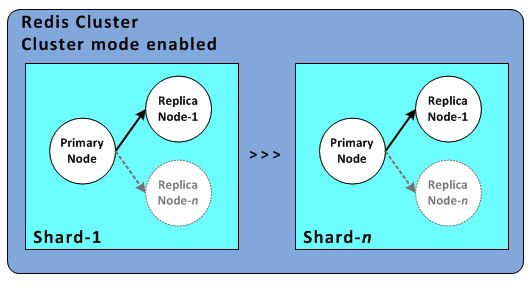
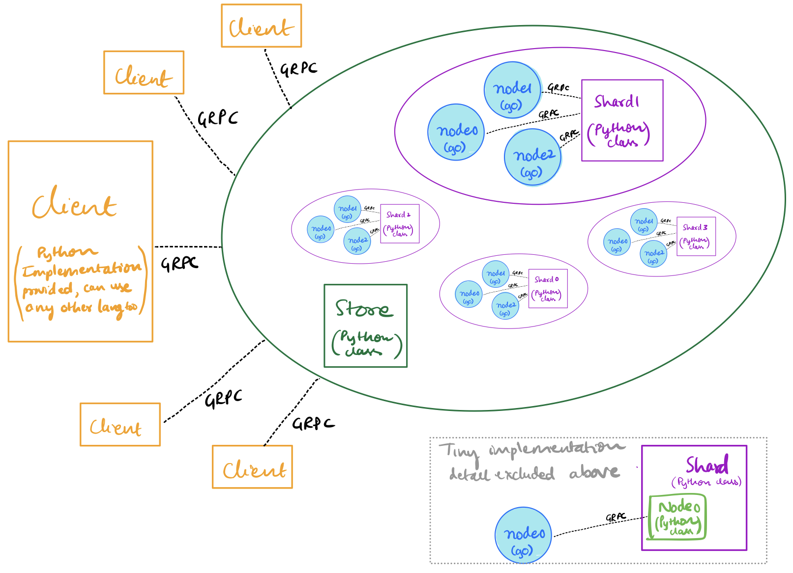

# Sharded Key / Value Store

Demo Video - [Onedrive Link](https://iiitaphyd-my.sharepoint.com/:v:/g/personal/kishan_sairam_students_iiit_ac_in/EYLDYB0E8UlNvmKRPVjKjO4BDXan5A2L_ENU8czE9Bs7VA?e=yP7yRw) (Enable 720p, lower resolutions look blurry with text)

## Problem Statement

- Key / Value Storage system that "shards," or partitions, the keys over a set of replica groups with read / write support
- RPCs for interaction between clients and servers
- Use PAXOS to replicate shards
    - Upon discussion with TA mentor regarding high complexity of PAXOS implementation and unavailability of trusted open source implementations, we had to look for alternatives
    - We found that RAFT was the only choice available to us to implement the project

## Architecture

- Each shard is a "replica set" and our final key / value store is a set of shards
- The system we are supposed to build is similar in structure to that of Redis operating in cluster mode as shown below



## Replication

- Using RAFT Algorithm to handle replication. RAFT is primarily a consensus algorithm
- Replication can be posed as consensus algorithm as achieving consensus on operations to perform

## Design Choices

### RAFT Implementation

- Two industry standard implementations available
    - Hasicorp raft [https://github.com/hashicorp/raft](https://github.com/hashicorp/raft) (go)
    - Etcd implementation [https://github.com/etcd-io/etcd](https://github.com/etcd-io/etcd)  (go)
- Upon discussion with TA mentor, we stuck to using Hashicorp as etcd itself is a distributed store and we are implementing a version of distributed store

### Interfacing RAFT & Language choice

- RAFT implementation is in go lang, hence we should use go lang as part of our implementation
- Instead of building entire pipeline in go lang we choose to use Python as our orchestrating language i.e., logic is implemented in Python where as consensus stays in go
- The primary reasons for this is the Exception Handling feature of Python. Since these are multiple moving parts interacting primarily through use of network calls, many different kinds of errors needs to be handled ranging from timeouts, database errors to raft leader issues etc., Thus having flexible error handling reduces complexity of implementation and time
    - Exceptions can be catched at the top in python, i.e., exceptions raised in nested function calls can be catched above
    - Where as in go lang we need to pass errors as return values through every call of function and return them to parent function, exception handling is harder to perform
    - We extensively used custom exceptions and catched them to detect different cases of exceptions, errors and issues encountered

### Data Storage

- Data storage can be done in memory, but we have the following issues
    - Doesn't scale easily as more records means more memory requirements but we might not have that much memory available
    - Recovery issue, with memory based storage we don't have file based recovery except from the consensus algorithm's logs if any (in case of disk based databases we have files written to disk every time thus can recover from it)
- Hence we used Disk backed KV Store at each node due to its advantages over Memory based storage
    - We do have one trade-off which is speed, memory based storage is faster, we have chosen scalability over speed
    - By using disk based store which supports faster access using memory caching we can mitigate this trade-off to some extent
- Utilised [Bitcask](https://github.com/prologic/bitcask). Supports fast access to up to 1M KV Pairs using disk as backing store
- If we want to scale even further to billions of records for each node we should use LevelDB for reasons mentioned [here](https://github.com/prologic/bitcask#is-bitcask-right-for-my-project)
- Since we are already sharding based on key, we stick to using Bitcask as after sharding key space for each node is reduced
- Due to modular implementation, it allows for easy replacement of backing store, primarily `node/fsm.go` has to be modified

## Implementation

### Architecture

- Replication implemented using Raft consensus algorithm (used hashicorp's go implementation)
- Interfaced "node" (each element in replica set) using GRPC from python
- Each "shard" is implemented as a set of nodes taking part in raft consensus
- "KVStore" is implemented as a set of shards



### Files and Directory Structure

```
.
├── Pipfile <Python Env>
├── Pipfile.lock <Python Env>
├── README.md
├── client.py <Wrapper Client> ||* GRPC Client Wrapper File *||
├── go.mod <Go Env>
├── go.sum <Go Env>
├── kvstore <Python implementation of Store>
│   ├── node.py <Node of replica set implemented using GRPC to Golang Node>
│   ├── shard.py <Shard as a replica set of nodes>
│   ├── store.py <Store as a collection of shards>
│   └── utils.py <Custom Exceptions>
├── kvstore.proto <Protobuf for KVStore service>
├── kvstore_grpc_server.py <KVStore GRPC Server> ||* File to run Server *||
├── node <Golang node implementation based on hashicorp raft>
│   ├── fsm.go <FSM for raft>
│   ├── node_grpc.pb.go <GRPC generated file>
│   ├── node_grpc_grpc.pb.go <GRPC generated file>
│   └── store.go <Node interface as a KVStore>
├── node_grpc.proto <Protobuf for Node in Golang>
├── node_grpc_server.go <Golang Node GRPC Server>
├── protoc_command.sh <Script for updating protobuf generated files>
├── python_grpc <GRPC Generated files>
    ├── kvstore_pb2.py
    ├── kvstore_pb2_grpc.py
    ├── node_grpc_pb2.py
    └── node_grpc_pb2_grpc.py
└── test.py <Sanity check and concurrent bechmark script>
```

### Extending implementation to Distributed Setting

- Currently we used python's subprocess package to handle spawning and terminating go lang node servers
- Through out implementation every other communication takes place through GPRC and hence can be done over the network as well, enabling easy extension to distributed setting
- To extend our implementation to distributed setting we only need the functionality of doing subprocess calls over the network. This can be done in couple of ways
    1. Use a package that supports distributed spawn and terminate of processes
    2. Create a RPC server on all the other servers we would like to distribute our application over and modify Node class perform operations on remote object rather than local

## Documentation

### Setup

- Install go lang from official site, setup env variables as required for using modules
- Run `go mod tidy` inside main directory to fetch all required packages
- Install pipenv on your system, and use it to install dependencies from provided Pipfile and then run pipenv shell from repo root to activate virtual env
    - If pipenv complains about specific version 3.9, ignore it and force python version using `-python` flag, any version >=3.7 should work hopefully

### KVStore Server

- Run `python3 kvstore_grpc_server.py <LOG_DIR_LOCATION>` to run GRPC Server for KVStore using default parameters

```
usage: kvstore_grpc_server.py [-h] [--port PORT] [--shard_cnt SHARD_CNT] [--replica_cnt REPLICA_CNT] [--max_workers MAX_WORKERS] [--print_req] storage_loc

KVStore Server Parameters

positional arguments:
  storage_loc           Location for storage of all logging and database

optional arguments:
  -h, --help            show this help message and exit
  --port PORT           Port of grpc server
  --shard_cnt SHARD_CNT
                        No of shards
  --replica_cnt REPLICA_CNT
                        No of replias for each shard
  --max_workers MAX_WORKERS
                        Max workers for grpc threadpool
  --print_req           Print requests as they arive to GRPC Server
```

### Client

- Clients interact using GRPC, a wrapper `client.py` is provided to handle GRPC requests to server
- Import `RequestWrapper` class from `client.py` and use it to perform interactions with KVStore by passing in location of GRPC Server
- Example run from python3 interpreter at root of repo

```
>>> from client import *
>>> t = RequestWrapper('localhost:7000')
>>> t.get('k1')
'v1'
>>> t.put('k3', 'v3')
>>> t.get('k3')
'v3'
>>> t.delete('k3')
>>> t.get('k3')
>>> t.get('k1')
'v1'
```

## Tests / Analysis

- Sanity Check
    - Using python dict as reference for correctness, performed all operations with checks for correctness
    - Initially filled database with 1000 entries, later performed another 1000 ops with each probability as
        - 0.15 - put
        - 0.35 - delete
        - 0.4 - get of keys existing in database
        - 0.1 - get of non existing keys in database
- Concurrent Benchmark - 1000 operations, get put delete with equal probability
    - We experimented with 10 GRPC Server workers and 20, we obtained similar performance with both, hence we stuck to using 10 workers
    - All the tests were run on 2018 Macbook Air with 8GB RAM, 1.6Ghz Dual core intel i5

5 Shards, each with 5 Replicas

- 1 worker - 1min 56s
- 3 workers - 4min 29s
- 5 workers - 7min 23s

5 Shards, each with 3 Replicas

- 1 worker - 1min 28s
- 3 workers - 3min 21s
- 5 workers - 4min 46s

1 Shard, with 5 replicas

- 1 worker - 1min 51s
- 3 workers - 5min 7s
- 5 workers - 7min 42s

3 Shards, each with 3 Replicas

- 1 worker - 1min 30s
- 3 workers - 3min 42s
- 5 workers - 5min 19s
- Explanation of observations from Concurrent benchmark
    - Note: As can be observed above for 1 worker i.e., no concurrent load we have lower number of shards and lower number of replicas every time to take lesser time. We don't consider 1 worker in the following explanation, as trivially lower both always favours when we have only 1 client. But having only 1 client is unlikely.
    - Same number of shards, different number of replicas
        - Consensus algorithm phase dominates more
        - Lower the number of replicas, lower the time
    - Different number of shards, same number of replicas
        - Higher number of shards takes lesser time
        - This is because due to sharing of requests among different shards, when we have concurrent operations happening, we get performance advantage

## References

- Following repos were referred while implementing replication based on raft consensus
    - [https://github.com/otoolep/hraftd](https://github.com/otoolep/hraftd)
    - [https://github.com/prologic/bitraft](https://github.com/prologic/bitraft)